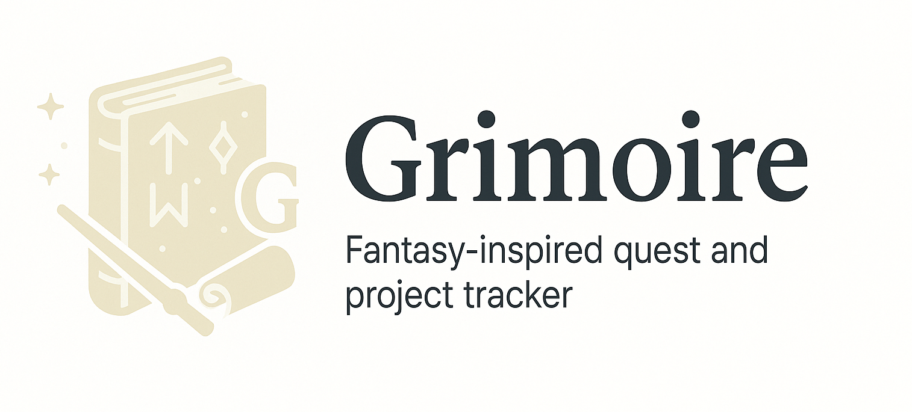

<h1 align="center">Grimoire 🧙‍♂️</h1>

<p align="center">
  A fantasy-inspired quest and project tracker with magic and structure.
</p>

<p align="center">
  
</p>

---

## ✨ О проекте

Grimoire — это таск-менеджер в стиле фэнтези:  
лёгкий, магический, но построенный на мощном современном стеке.  
Идеален для трекинга задач, проектов и квестов.

---

## 🛠️ Технологии

### Frontend
- **React 19**
- **Vite 6**
- **TypeScript**
- **React Router 7**
- **Zustand** (управление состоянием)
- **Framer Motion** (анимации)
- **Axios** (работа с API)
- **SCSS** (локальные стили, без Tailwind)
- **Feature-Sliced Design (FSD)** (архитектура проекта)
- **Google Fonts** (Inter + Cinzel Decorative)

### Backend
- **NestJS**
- **TypeScript**
- **PostgreSQL** через **Prisma ORM**
- **JWT Authentication** (access/refresh токены)
- **Docker Compose** (бэкенд + база данных)
- **Clean Architecture** на сервере
- **Защита приватных маршрутов через Guards**

---
---

## 🚀 Миссия
Создать пространство, где идея не теряется, сценарий не забывается, а вдохновение становится проектом.

---

## 🧭 Roadmap

### ✅ MVP 1.0
- [x] Проекты и задачи (todo, done, in progress)
- [x] Типы задач: `idea`, `script`, `note`, `task`
- [x] Markdown-редактор для сценариев и заметок
- [x] Хранилище идей ("Vault") с быстрым созданием
- [x] Авторизация и пользовательский профиль
- [x] Интеграция с AI (OpenAI API)
  - [x] Суммаризация задачи
  - [x] Расширить идею (Expand idea)
  - [x] Переформулировать (Rephrase)

### 🔜 1.1 — Pages и флоу контента
- [ ] Поддержка "страниц" для длинных сценариев / outline
- [ ] AI генерация outline по теме
- [ ] Перетаскивание тасков между проектами
- [ ] Drag & Drop интерфейс для Vault

### 🔮 2.0 — Мультимодальные задачи
- [ ] Возможность прикреплять картинки, аудио и видео
- [ ] Календарь релизов (YouTube / Insta / Blog)
- [ ] AI suggestions based on content type
- [ ] Канбан-доска и Timeline view

---

## ✨ Ключевые фичи

### 🧠 Vault (Сундук идей)
- Быстрое добавление идеи без фокусировки
- Теги, быстрый поиск, draft-режим
- Превращение идеи в полноценный таск/сценарий

### 📄 Страницы и сценарии
- Markdown-редактор с AI-инструментами:
  - Expand
  - Improve
  - Summarize
  - Rephrase
- Автосохранение и история версий

### 🎬 Типы задач
Каждая задача может быть:
- `idea` — краткая мысль или тезис
- `script` — развёрнутое содержание или сценарий
- `task` — конкретное действие ("отснять сцену", "написать абзац")
- `note` — любые заметки к проекту

### 🤖 AI-помощник (Grimoire AI)
- Встроен прямо в редактор задач
- Умеет:
  - Расширить идею до сценария
  - Улучшить текст
  - Сгенерировать outline по заголовку
  - Придумать логлайн или описание

---

<p align="center">
  <i>"Let the magic organize your chaos."</i>
</p>
```